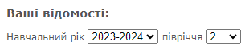
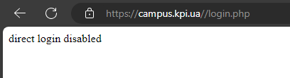

# KPI Campus Tweaker Extension

The Campus Tweaker extension helps to remove campus glitches and improves the user experience

[Chrome Web Store👻](https://chromewebstore.google.com/detail/kpi-campus-tweaker/fjniiloehmapkpnhkafokeeidjioohhp)

## Features

- **Automatic display of subjects in the current semester**: The extension automatically sets the values of the current academic year and semester in the `<select>` type fields at [Current Control](https://campus.kpi.ua/student/index.php?mode=studysheet) page
  
- **Fixes `direct login disabled` error**: Fixes an error that sometimes occurs during the session refresh process. This is due to the fact that very experienced campus developers have not been able to fix this bug for years, which occurs due to an extra slash in the URL - `https://campus.kpi.ua//login.php`
  

## Installation

To install the KPI Campus Tweaker extension, follow these steps:

1. Clone the repository or download the ZIP file and unzip to any folder.
2. Go to extensions page in Google Chrome
3. Turn on developer mode
4. Press 'Load unpacked' button and choose repository folder
5. Enjoy!

## Feedback

We value your feedback! If you have any suggestions, bug reports, or feature requests, please don't hesitate to reach out to us.

## License

This extension is released under the [MIT License](https://opensource.org/licenses/MIT). Feel free to modify and distribute it as per the terms of the license.
